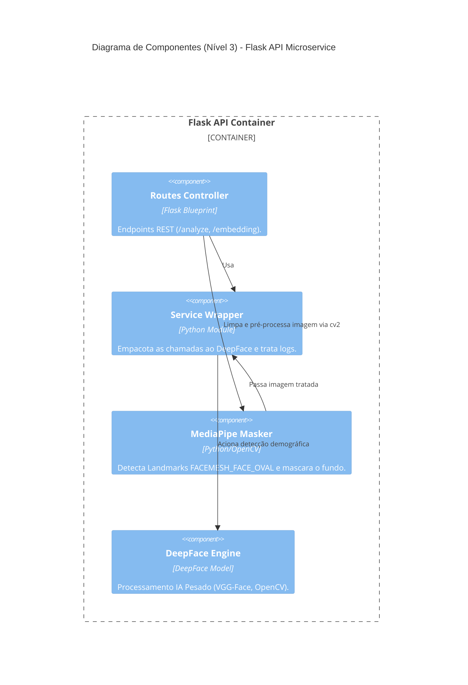

```mermaid
C4Component
    title Diagrama de Componentes (Nível 3) - Flask API Microservice

    Container_Boundary(flask_api, "Flask API Container") {
        Component(flask_router, "Routes Controller", "Flask Blueprint", "Endpoints REST (/analyze, /embedding).")
        Component(service_wrapper, "Service Wrapper", "Python Module", "Empacota as chamadas ao DeepFace e trata logs.")
        Component(mediapipe_mask, "MediaPipe Masker", "Python/OpenCV", "Detecta Landmarks FACEMESH_FACE_OVAL e mascara o fundo.")
        Component(deepface_lib, "DeepFace Engine", "DeepFace Model", "Processamento IA Pesado (VGG-Face, OpenCV).")
        
        Rel(flask_router, service_wrapper, "Usa")
        Rel(flask_router, mediapipe_mask, "Limpa e pré-processa imagem via cv2")
        Rel(mediapipe_mask, service_wrapper, "Passa imagem tratada")
        Rel(service_wrapper, deepface_lib, "Aciona detecção demográfica")
    }
```
