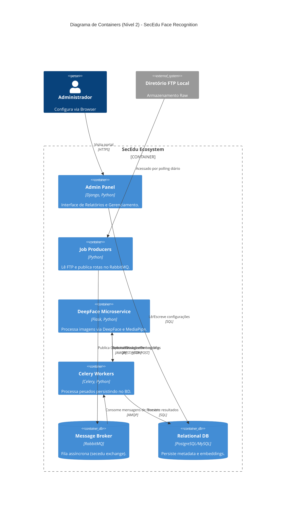

```mermaid
C4Container
    title Diagrama de Containers (Nível 2) - SecEdu Face Recognition

    Person(admin, "Administrador", "Configura via Browser")
    System_Ext(camera, "Diretório FTP Local", "Armazenamento Raw")

    Container_Boundary(secedu_boundary, "SecEdu Ecosystem") {
        Container(django_admin, "Admin Panel", "Django, Python", "Interface de Relatórios e Gerenciamento.")
        Container(jobs_faces, "Job Producers", "Python", "Lê FTP e publica rotas no RabbitMQ.")
        Container(flask_api, "DeepFace Microservice", "Flask, Python", "Processa imagens via DeepFace e MediaPipe.")
        Container(celery_workers, "Celery Workers", "Celery, Python", "Processa pesados persistindo no BD.")
        
        ContainerDb(rabbitmq, "Message Broker", "RabbitMQ", "Fila assíncrona (secedu exchange).")
        ContainerDb(database, "Relational DB", "PostgreSQL/MySQL", "Persiste metadata e embeddings.")
    }

    Rel(camera, jobs_faces, "Acessado por polling diário")
    Rel(jobs_faces, rabbitmq, "Publica CaptureMessage em", "AMQP")
    Rel(rabbitmq, celery_workers, "Consome mensagens de face em", "AMQP")
    Rel(celery_workers, flask_api, "Solicita Extração/Demografia", "REST/HTTP POST")
    Rel(flask_api, celery_workers, "Retorna Dados e Embeddings", "JSON")
    Rel(celery_workers, database, "Persiste resultados", "SQL")
    Rel(admin, django_admin, "Visita portal", "HTTPS")
    Rel(django_admin, database, "Lê/Escreve configurações", "SQL")
```
