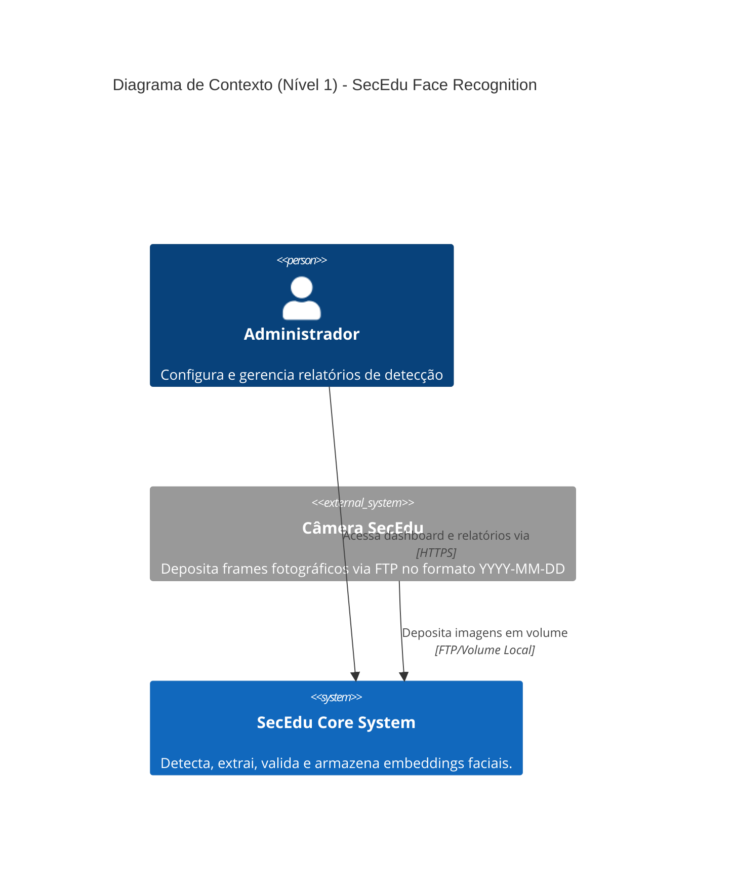

```mermaid
C4Context
    title Diagrama de Contexto (Nível 1) - SecEdu Face Recognition
    
    Person(admin, "Administrador", "Configura e gerencia relatórios de detecção")
    System_Ext(camera, "Câmera SecEdu", "Deposita frames fotográficos via FTP no formato YYYY-MM-DD")
    
    System(secedu_sys, "SecEdu Core System", "Detecta, extrai, valida e armazena embeddings faciais.")
    
    Rel(admin, secedu_sys, "Acessa dashboard e relatórios via", "HTTPS")
    Rel(camera, secedu_sys, "Deposita imagens em volume", "FTP/Volume Local")
```
