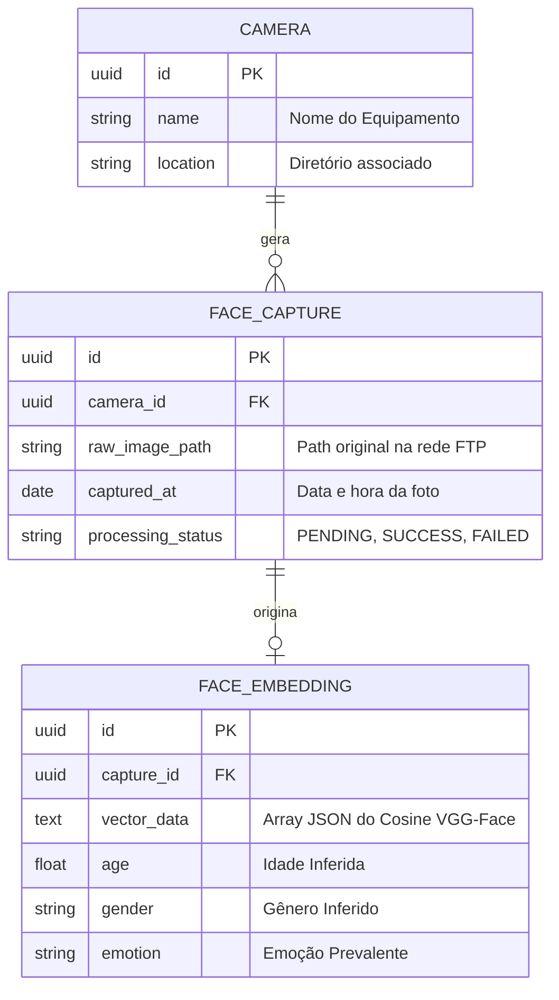

```mermaid
erDiagram
    %% Entidades baseadas em inferência da comunicação de rede (Django + Workers)
    CAMERA {
        uuid id PK
        string name "Nome do Equipamento"
        string location "Diretório associado"
    }
    
    FACE_CAPTURE {
        uuid id PK
        uuid camera_id FK
        string raw_image_path "Path original na rede FTP"
        date captured_at "Data e hora da foto"
        string processing_status "PENDING, SUCCESS, FAILED"
    }
    
    FACE_EMBEDDING {
        uuid id PK
        uuid capture_id FK
        text vector_data "Array JSON do Cosine VGG-Face"
        float age "Idade Inferida"
        string gender "Gênero Inferido"
        string emotion "Emoção Prevalente"
    }

    CAMERA ||--o{ FACE_CAPTURE : "gera"
    FACE_CAPTURE ||--o| FACE_EMBEDDING : "origina"
```
