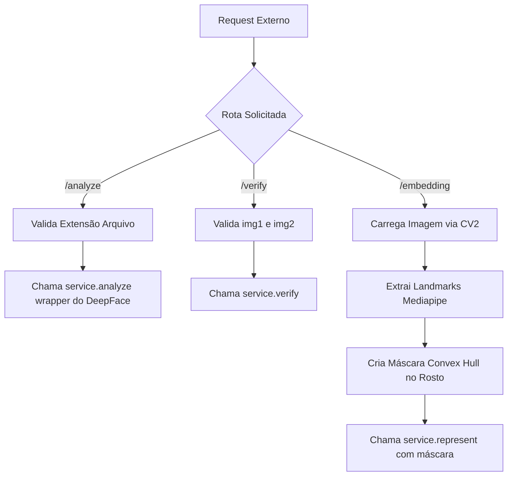

```mermaid
graph TD
    A[Request Externo] --> B{Rota Solicitada}
    B -->|/analyze| C[Valida Extensão Arquivo]
    C --> D[Chama service.analyze wrapper do DeepFace]
    B -->|/verify| E[Valida img1 e img2]
    E --> F[Chama service.verify]
    B -->|/embedding| G[Carrega Imagem via CV2]
    G --> H[Extrai Landmarks Mediapipe]
    H --> I[Cria Máscara Convex Hull no Rosto]
    I --> J[Chama service.represent com máscara]
```
