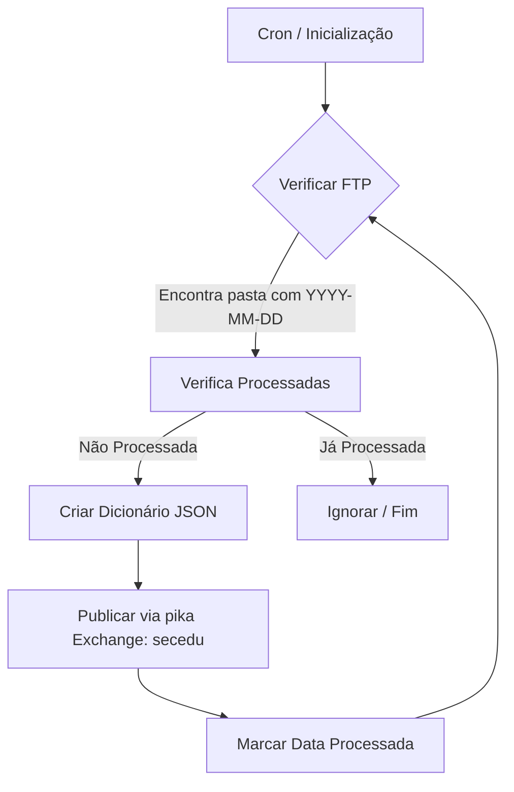

```mermaid
graph TD
    A[Cron / Inicialização] --> B{Verificar FTP}
    B -->|Encontra pasta com YYYY-MM-DD| C[Verifica Processadas]
    C -->|Não Processada| D[Criar Dicionário JSON]
    D --> E[Publicar via pika Exchange: secedu]
    E --> F[Marcar Data Processada]
    C -->|Já Processada| G[Ignorar / Fim]
    F --> B
```
