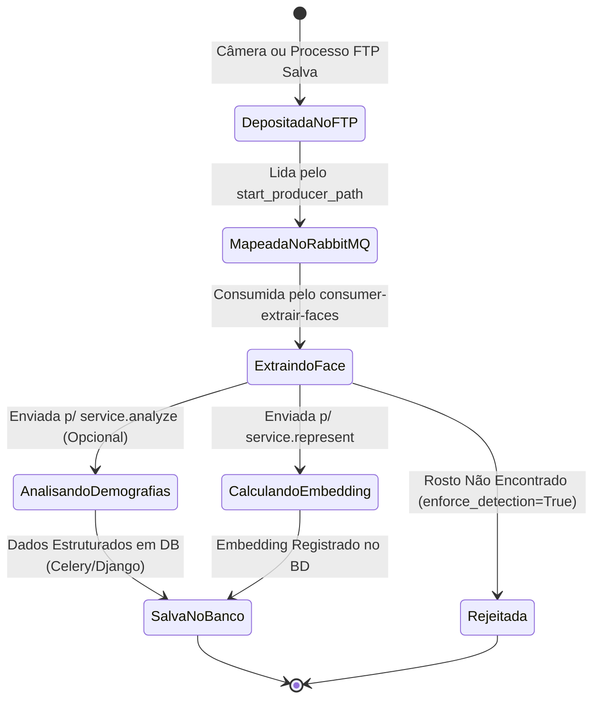

# Máquinas de Estado do Sistema

A máquina de estado principal orbita as Imagens (Frames de FTP) desde que entram no ecossistema até serem analisadas/embutidas (Embeddings) pelo sistema distribuído.

## Entidade: Imagem de Captura / CaptureMessage

